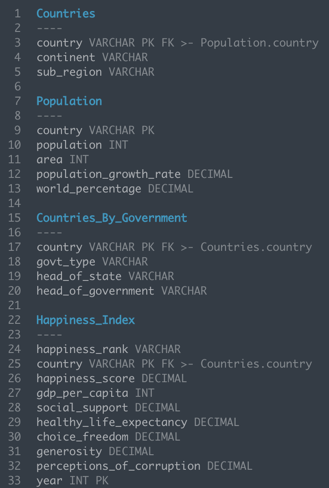

## ELT Project- Happiness Index

## Table of contents
* [General Info](#general-info)
* [Extract](#extract)
* [Transform](#transform)
* [Load](#load)
* [Queries](#queries)
* [Run Data](#run-data)
* [Resources](#resources)
* [Contacts](#contacts)

## General Info
Are you looking for more information on your target customer market? Or maybe you are looking for a new place to move? We have the database for you! The **Happiness Database**. Our database compares the Happiness Index of a country and other Geopolitical factors.

What is the Happiness Index? It is a rating of a country’s happiness on a scale of 1 to 10- where 10 is the happiest and 1 is the lease happy. There are a series of questions that are asked, and the sum of the answers is equal to the countries Happiness Score. 

## Extract

Our data came from several sources. We pulled CSV files as well as web scraped data. The CSVs were from sources such as Kaggle. The web scraping was from a site about countries that include current government types.  There are 193 countries in the world, however, our main Happiness Index CSV file included 153 counties that were surveyed. All data sets had country name as a common field.

## Transform
We imported our data sets into `Jupyter Notebook` to manipulate and transform our datasets. We had to reformate and clean our CSV files so that they were readable, and the columns were consistent. We did this by renaming columns and comparing country names to ensure all data was callable in our `SQL` queries. We also removed null values in areas that would not have been meaningful.

Our country csv was a list of country, continent a region. We renamed the columns to be consistent. 

###Countries Table

We also `merged` the Country names against a year of our Happiness Index to make sure the data included the same list of countries.

To export the data to our `PostgreSQL` we use the following code including ` df.to_sql( ) ` . Also, we used `if_exists=”append” ` so that we would not keep adding to our tables in SQL if the table had data in it already. 

We saved this database to a csv to use as a master country list in our other data sets for consistency. 

###Government Table

The government table came from Web Scraping as website that had a list of government types by country. We used the pandas code ` pd.read_html( ) ` to read the data in `jupyter notebook` . 

We then cleaned up the column names and `merged` the data with our countries table to make sure the list of countries matched. 

To export to SQL, we used the below code :

###Happiness Index

The Happiness CSVs we found consisted of 5 CSV files over 5 years of time. We decided not to `aggregate` the data in the csv so that could have a record of all 5 years of Happiness Score. 

Every year of data had different column names, so we had to rename all the CSV files before adding them together. 

Once the columns were consistent, we used the `pandas` function ` pd.concat( ) ` to add the 5 CVS years of data into one master table. 

To export the data to `SQL` we used the following code:

### Population Table

For our population table, we used a CSV of population over many years including future population predictions. We only need the population of the countries in our data frame, so we remade the table using only 2019 populations. 

Then we cleaned the data further by renaming the columns to be consistent and clear. 

To export to `SQL` we used the following code :

### ERD

To organize our data sets we use an Entity Relationship Diagram (ERD) tool. We created sample tables and linked them on primary keys which included country name. WE then exported he schema into PostgreSQL to create our tables. 

## Load

Within postgress, we created tables based on our schema. Then we rand the code in jupyter notebook to import our clean database information into the new tables we made in postgress. 

## Queries 

Once the data was there, we created specific queries to call datasets. These queries were:

We felt these were important representations of our data set because they showed the relationship between a country’s happiness index and their geopolitical factors. 

## Run Data

How to recreate our database:
Clone repo to your desktop. 
Open PG Admin and import Schema
Run all of Schema
Open CSV files notebooks in Jupyter notebook 
Your conda environment needs the following dependencies to run these notebooks:	
	sqlalchemy 
	pandas 
	psycopg2
	Config.py file

Run notebooks completely. 

User will have to create a file called ‘config.py’ and save it in the main folder of repo. User will need to create a value called ‘postgress_pwd = {password}” whose value is equal to the users postgress password for PG Admin.   

Once the tables are populated in PG Admin, you can run our queries. They are saved in a file called query.sql .

## Resources 

[Kaggle- Happiness Index](https://www.kaggle.com/unsdsn/world-happiness)

[Happiness Index Report](https://worldhappiness.report/ed/2019/#read)

[Government Types](https://www.mapsofworld.com/thematic-maps/types-of-governments.html)

[Kaggle- Country Codes](https://www.kaggle.com/statchaitya/country-to-continent)

[World Population](https://worldpopulationreview.com/)

## Contacts

[Ashley DaCosta](https://github.com/aledacosta93)

[Sai Prasanna Dasari](https://github.com/prasanna0913)

[Tim Samson](https://github.com/timsamson)

[Sara Simoes](https://github.com/Ssimoes48)
